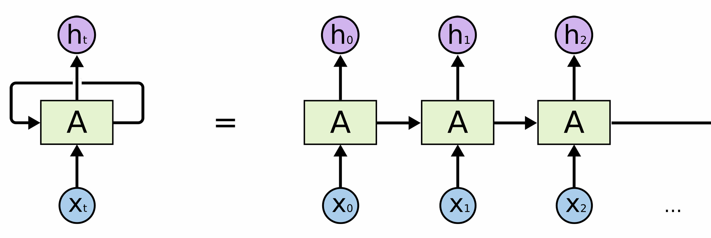
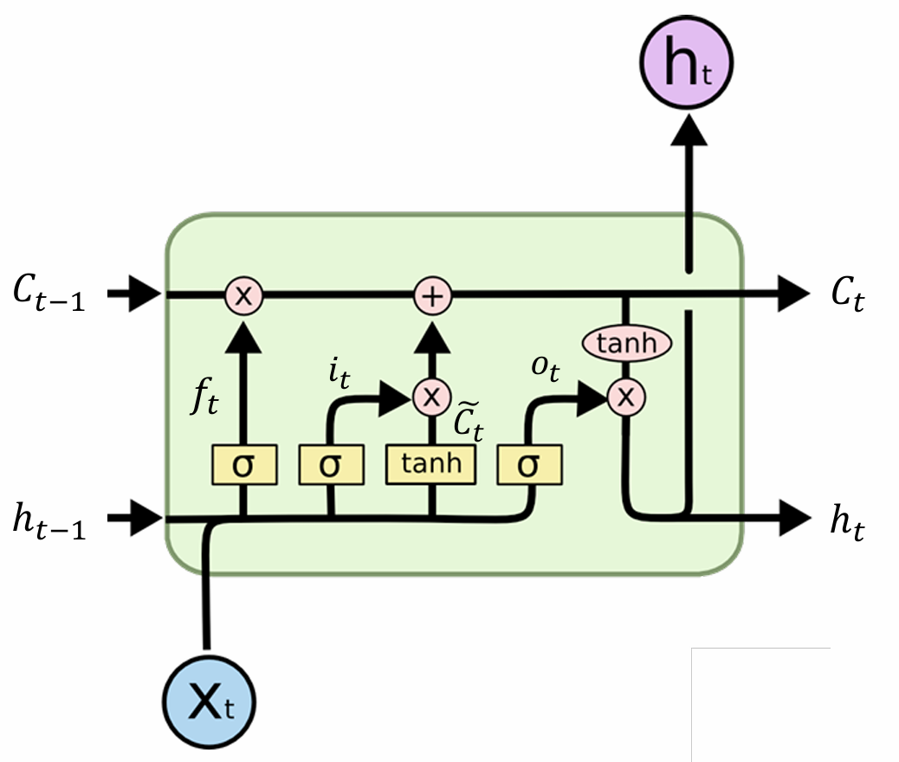

# Recurrent Networks on MNIST

An educational PyTorch notebook for classifying handwritten digits by reading
each image one row at a time. It defines both a vanilla recurrent neural network
(RNN) and a long short-term memory network (LSTM), with **LSTM active by default**.
The example connects recurrent state updates to a complete training loop.

## Repository contents

| File | Purpose |
| --- | --- |
| [sequentialMNIST.ipynb](sequentialMNIST.ipynb) | Dataset adapter, RNN/LSTM model, trainer, evaluation, and learning curves |
| [img/RNN.png](img/RNN.png) | RNN illustration |
| [img/LSTM.png](img/LSTM.png) | LSTM illustration |
| [LICENSE](LICENSE) | MIT license |

Basic familiarity with tensors, gradient descent, and classification losses is
useful. The [foundational examples](https://github.com/kapshaul/deep-learning)
provide an earlier starting point.

## Setup and execution

Use a Python version supported by your chosen PyTorch release. From the repository
directory, create an environment and install the notebook's dependencies:

```bash
git clone https://github.com/kapshaul/deep-learning-rnn.git
cd deep-learning-rnn
python3 -m venv .venv
source .venv/bin/activate
python -m pip install --upgrade pip
python -m pip install torch torchvision numpy matplotlib jupyterlab ipykernel
python -m ipykernel install --user --name deep-learning-rnn --display-name "Python (deep-learning-rnn)"
python -m jupyterlab sequentialMNIST.ipynb
```

Select the **Python (deep-learning-rnn)** kernel in JupyterLab.

On Windows, activate the environment with `.venv\Scripts\Activate.ps1` in
PowerShell. For a CUDA installation, use the command from the
[official PyTorch installation selector](https://pytorch.org/get-started/locally/)
for `torch` and `torchvision`, then install the remaining packages above. Package
versions are not pinned in this repository.

Before running the cells:

1. Review the loss-function caveat below if you intend to compare training results.
2. For a first notebook run, set `num_workers=0` in **both** `DataLoader` calls in
   `main()`. The checked-in value is `2`; notebook-defined dataset classes can
   cause worker startup or pickling failures with multiprocessing. Single-process
   loading also makes errors easier to inspect. See the
   [PyTorch data-loading guide](https://docs.pytorch.org/docs/stable/data.html#single-and-multi-process-data-loading).
3. Optionally reduce `max_epochs` from `20` to `1` for an initial trial.
4. Execute all five code cells in order. The last cell calls `main()` and starts
   training; rerunning it creates a new model and begins again.

The first run downloads MNIST to `./mnist_data/`, relative to the notebook's
working directory, so it requires network access. Later runs reuse the downloaded
files. The code selects CUDA when available and otherwise uses CPU; it does not
select Apple's MPS backend.

Each epoch prints loss, training accuracy, and a value labelled `Val Acc`.
The final plot shows loss and accuracy, with training points recorded per batch
and evaluation points recorded per epoch. The notebook does not save a trained
checkpoint: its `torch.save` block is commented out.

## How an image becomes a sequence

`transforms.ToTensor()` converts a grayscale image to a tensor of shape
`(1, 28, 28)` with pixel values in `[0, 1]`.
`SequentialMNISTDataset.__getitem__()` removes the channel dimension with
`squeeze(0)`, leaving `(28, 28)`.

The first dimension is interpreted as **28 time steps**, each containing the
**28 pixels of one row**, in their original top-to-bottom order. The notebook
does not flatten an image into 784 individual time steps or permute the pixels.
Keep this representation in mind when comparing with other sequential-MNIST
experiments. See the torchvision references for
[MNIST](https://docs.pytorch.org/vision/stable/generated/torchvision.datasets.MNIST.html)
and [ToTensor](https://docs.pytorch.org/vision/stable/generated/torchvision.transforms.ToTensor.html).

For a batch of size `B`, the default model uses these shapes:

| Stage | Shape | Meaning |
| --- | --- | --- |
| Input | `(B, 28, 28)` | Batch, image rows, pixels per row |
| Recurrent output | `(B, 28, 128)` | One hidden representation per row |
| `out[:, -1, :]` | `(B, 128)` | Representation after the final row |
| Linear output | `(B, 10)` | One score per digit class |
| Current `forward()` result | `(B, 10)` | Scores after softmax |
| Targets | `(B,)` | Integer digit labels from 0 to 9 |

`batch_first=True` determines the input/output ordering. The returned final hidden
state has shape `(1, B, 128)`; LSTM also returns a cell state of that shape.
Initial states default to zero for each call and are not carried across batches.

## Model and training defaults

| Setting | Checked-in value |
| --- | --- |
| Recurrent layer | One unidirectional LSTM; an alternative tanh RNN is also defined |
| Input / hidden / output dimensions | `28` / `128` / `10` |
| Classifier | `nn.Linear(128, 10)`, with weights and bias initialized to zero |
| Optimizer | Adam, learning rate `1e-3`, weight decay `0.001` |
| Loss | `nn.CrossEntropyLoss()`; see the caveat below |
| Batch size / epochs | `128` / `20` |
| Training loader | Shuffled, `num_workers=2` |
| Evaluation loader | Unshuffled, `num_workers=2` |

Both recurrent modules are registered in `Net`, but only the one called by
`forward()` participates in the prediction. The notebook does not train or
compare both models automatically.

To try the vanilla RNN, replace the active LSTM call in `Net.forward()`:

```python
# LSTM (default)
out, (h, c) = self.lstm(x)

# RNN alternative: use this line instead of the LSTM line
out, h = self.rnn(x)
```

Keep only one call active, rerun the model-definition cell, and then rerun the
final cell to create and train a fresh model.

## Recurrent state updates

For a single image, let $x_t \in \mathbb{R}^{28}$ be row $t$ and
$h_t \in \mathbb{R}^{128}$ its hidden state. The same weights are reused at all
28 steps. With column-vector notation, the tanh RNN computes

$$
h_t = \tanh(W_x x_t + W_h h_{t-1} + b).
$$

Here $W_x \in \mathbb{R}^{128 \times 28}$,
$W_h \in \mathbb{R}^{128 \times 128}$, and $b \in \mathbb{R}^{128}$.
The bias combines PyTorch's input and recurrent bias terms. The final state
summarizes the rows for classification. See the
[PyTorch RNN reference](https://docs.pytorch.org/docs/stable/generated/torch.nn.RNN.html).

<p align="center">
  
</p>

An LSTM adds a cell state $c_t$ and gates that control which values are retained,
written, and exposed as the hidden state. Let $u_t = [h_{t-1}; x_t]$ denote
concatenation. Its updates can be written as

$$
\begin{aligned}
f_t &= \sigma(W_f u_t + b_f), & i_t &= \sigma(W_i u_t + b_i), \\
g_t &= \tanh(W_g u_t + b_g), & o_t &= \sigma(W_o u_t + b_o), \\
c_t &= f_t \odot c_{t-1} + i_t \odot g_t, \\
h_t &= o_t \odot \tanh(c_t).
\end{aligned}
$$

$f_t$, $i_t$, and $o_t$ are the forget, input, and output gates; $g_t$ is the
candidate cell update. $\sigma$ is the sigmoid function and $\odot$ means
elementwise multiplication. Each $W$ above has shape $128 \times 156$ and each
bias has 128 elements, combining the separate terms used by PyTorch. This gated
cell update provides a way to retain information across steps; this example
does not establish that LSTM outperforms RNN. See the
[PyTorch LSTM reference](https://docs.pytorch.org/docs/stable/generated/torch.nn.LSTM.html).

<p align="center">
  
</p>

## Interpreting results and known limitations

- **Loss input:** `Net.forward()` currently applies `F.softmax`, then the trainer
  passes that result to `nn.CrossEntropyLoss()`. PyTorch expects raw class logits
  for this loss, so the notebook applies an extra normalization and optimizes a
  different objective from the usual cross-entropy on the classifier scores.
  For a conventional setup, change `return F.softmax(out, dim=1)` to `return out`
  in the notebook before training; use softmax separately when probabilities are
  needed. Argmax-based accuracy works with either representation. This README
  documents the issue; the checked-in notebook still contains the original code.
  See the [CrossEntropyLoss reference](https://docs.pytorch.org/docs/stable/generated/torch.nn.CrossEntropyLoss.html).
- **Evaluation split:** `val_data` uses `MNIST(train=False)`, the official test
  split. Its results are labelled validation in the notebook, but there is no
  separate validation split. If tuning hyperparameters, reserve validation data
  from the training split and keep test data for final evaluation.
- **Reproducibility:** no random seed is set, package versions are not pinned,
  and no repeated-run comparison is implemented. Record your environment,
  settings, model choice, and any notebook edits alongside results.
- **Scope:** the implementation processes fixed-length row sequences. It does
  not demonstrate variable-length batching, sequence generation, or stateful
  prediction across separate batches, despite importing some sequence utilities.

## Related repositories

| Repository | Focus |
| --- | --- |
| [deep-learning](https://github.com/kapshaul/deep-learning) | Sine regression and XOR classification |
| [deep-learning-cnn](https://github.com/kapshaul/deep-learning-cnn) | Convolutional networks and MNIST image classification |
| [deep-learning-math](https://github.com/kapshaul/deep-learning-math) | Mathematical derivations and MATLAB examples |

## License

This repository is available under the [MIT License](LICENSE).
